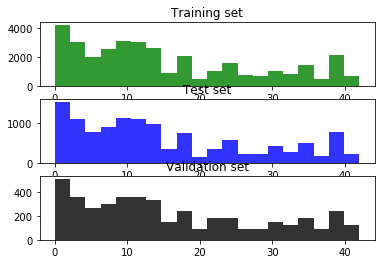
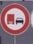
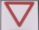
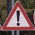
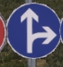
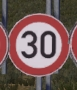

Traffic Sign Recognition

Writeup

Build a Traffic Sign Recognition Project

The goals / steps of this project are the following:

    Load the data set (see below for links to the project data set)
    Explore, summarize and visualize the data set
    Design, train and test a model architecture
    Use the model to make predictions on new images
    Analyze the softmax probabilities of the new images
    Summarize the results with a written report

Rubric Points

Here I will consider the rubric points individually and describe how I addressed each point in my implementation.

Writeup

Here is a link to my project code: [Project code](https://github.com/ytpub01/CarND-Traffic-Sign-Classifier-Project "Here is a link to my project code")

Data Set Summary & Exploration

I used the pandas library to calculate summary statistics of the traffic signs data set:

    The size of training set is 34799
    The size of the validation set is 4410
    The size of test set is 12630
    The shape of a traffic sign image is (32, 32, 3)
    The number of unique classes/labels in the data set is 43

Here is an exploratory visualization of the data set. It is a bar chart showing how the data classification is distributed.

Design and Test a Model Architecture

1. Describe how you preprocessed the image data.

I converted the images to grayscale because it improved the execution efficiency, making it faster.

I normalized the image data because gradient descent runs more efficiently with normalized data.

2. Model architecture

My final model consisted of the following layers:
Layer 	            Description
Input 	            32x32x3 RGB image
Convolution 5x5 	1x1 stride, valid padding, outputs 28x28x18	
Max pooling 	    2x2 stride, outputs 14x14x18
Convolution 5x5 	1x1 stride, valid padding, outputs 10x10x48
Max pooling         2x2 stride, outputs 5x5x48
Flatten             outputs 1200
Fully connected 	outputs 360
Fully connected     outputs 252
Fully connected     output layer, outputs 43 	        
	
    
3. How the model was trained

To train the model, I used an AdamOptimizer with a learning rate of 0.0025, a batch size of 128, and 10 epochs. I set the minimum validation accuracy at 0.94, and the maximum training accuracy at 0.995 to avoid overfitting.

I tried slower learning rate but that made reaching an acceptable validation accuracy slower with too much overfitting due to needing more epochs. I tried a faster learning rate but that kept the validation accuracy too low. A lower maximum training accuracy did not achieve a validation accuracy that I required of at least 0.94.

4. Approach for solution

I used the LeNet implementation, scaling it up to use RGB images.

My final model results were:

    validation set accuracy of 0.948
    test set accuracy of 0.929

    The architecture I tried was LeNet and I chose it because it solves
    a similar image classification problem. Some problems with the
    initial architecture where in the decision of whether there too
    many dense layers. The architecture was minimally adjusted
    to accomodate RGB images. A high accuracy on the validation set
    was obtained. I used the standard parameters with no adjustment.
    A convolution layer worked well with this problem because image
    features classified by scaling up from detailed features into
    overall features is a very well-adapted model for image
    classification that is implemented with convolutional layers.

    The LeNet architecture was relevant to the traffic sign
    application because it was successful with the MNIST database
    of images. My final model's accuracy was about 95% on
    the validation set and about 93% and on the test set.

Test the Model on New Images

1. Five German traffic signs found on the web

Here are five German traffic signs that I found on the web:

    

The 30-km speed limit image might be difficult to classify because there are slight portions of other signage in it. The Go Forward or Right sign might be difficult because it is in a darker color and resembles other dark-blue signs.

2. Model's predictions on new traffic signs

Predictions:
Image 1 - No passing for vehicles over 3.5 metric tons, 
Image 2 - Yield, 
Image 3 - General caution, 
Image 4 - Go straight or right,  
Image 5 - Speed limit (30km/h).

The model was able to correctly guess 5 of the 5 traffic signs, which gives an accuracy of 100%. This compares favorably to the accuracy on the test set of 93%.

3. Certainty of the model predictions on the five new test images

The code for making predictions on my final model is located in code cell 16 of the Ipython notebook.

Top predictions with probabilities

Image 1 : 
No passing for vehicles over 3.5 metric tons   30%, 
Go straight or left   23%, 
Dangerous curve to the right   12%, 
No passing   12%, 
Keep left   8%

Image 2 : 
Yield   77%, 
Children crossing   38%, 
Ahead only   38%, 
No vehicles   22%, 
No passing   14%, 

Image 3 : 
General caution   50%, 
Traffic signals   22%, 
Beware of ice/snow   11%, 
Pedestrians   10%, 
Right-of-way at the next intersection   8%, 

Image 4 : 
Go straight or right   19%, 
General caution   10%, 
Dangerous curve to the left   9%, 
Road work   8%, 
Dangerous curve to the right   6%

Image 5 : 
Speed limit (30km/h)   50%, 
Speed limit (20km/h)   43%, 
Speed limit (80km/h)   29%, 
Speed limit (50km/h)   18%, 
Speed limit (70km/h)   17%
